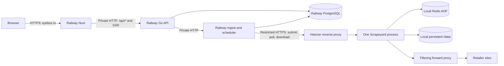

# Scrapeyard and Eyebox deployment assessment — 2026-09-07

**Recommendation: retain Railway for Eyebox and a separate Hetzner host for
Scrapeyard. This is suitable for a small launch with recoverable ingestion
interruptions, but the checked-in deployment material is not yet a complete,
qualified production installation.** Finish the specific deployment work below
before opening public traffic.

This assumes a small initial audience, one operator, and tolerance for brief
maintenance outages. Traffic, recovery objectives, and a spending ceiling have
not been supplied. The recommendation favors reduced server administration
over the lowest possible hosting bill. It does not promise high availability.

Reviewed Scrapeyard HEAD `2cb332723f711fd5073de11c50f75f73c36e0eaa` and
Eyebox HEAD `757ef54da09db76c787207318e8cd4a943aa6bf1`, including Eyebox's
existing uncommitted changes. This was source and official-documentation
research: no live accounts, production state, retailer traffic, deployments,
or fresh application test runs were inspected. Historical qualification does
not qualify the current working trees. This report does not close gates in
Eyebox's [go-live checklist](../../eyebox/GO-LIVE-TESTING-CHECKLIST.md).

**Recommended placement and request flow**

| Component | Placement | Launch configuration |
| --- | --- | --- |
| Nuxt web | Railway, alongside the other Eyebox services | Public canonical HTTPS hostname; add same-origin `/api/*` forwarding to the private Go API |
| Go API | Same Railway project, environment, and region | Private HTTP; one initial replica; readiness at `/api/v1/readyz` |
| FastAPI ingest | Same Railway environment | Private HTTP, always running, one worker and one configured replica; owns scheduling |
| PostgreSQL | Same Railway environment | Persistent volume, explicitly selected/tested major version, private TLS connections, backups and PITR |
| Scrapeyard | One Hetzner Linux x86-64 VPS | One process/replica, persistent local `/data`, existing browser confinement and resource limits |
| Redis and egress probe | Same Hetzner Docker network | Private; Redis AOF persisted independently of `/data` |
| Scrapeyard HTTPS ingress | Hetzner host reverse proxy | Restrict to Railway ingest's complete outbound IPv4 set and a named project credential |
| Scraping forward proxy | Explicit operator-selected service | Required by current production mode; independently qualify destination filtering and retailer compatibility |

The Nuxt API-forwarding route in this diagram is proposed work, not an existing
feature. Eyebox's scheduled adapter already submits YAML, polls job status,
and downloads results over HTTP, with stable idempotency keys and bounded
retries. It removes the YAML webhook block. Keep that path: there is no need
for cross-provider database access, shared files, or production webhooks.
See [scheduled adapter](../../eyebox/ingest/scheduled_scrapeyard.py) and
[existing topology](../../eyebox/docs/deployment-topology.md).

The separation is useful even with only one consumer. Browser workload and
host maintenance can interrupt scraping while Eyebox continues serving the
catalog already in PostgreSQL. An extended scraper outage still affects
freshness, so this separation needs stale-data monitoring. Scrapeyard's
SQLite, local artifacts, embedded workers, and singleton coordinators make a
single VPS a natural fit. Keep its databases and Redis together; another API
replica is explicitly unsupported. See [scaling boundary](SCALING.md).

Railway is a reasonable home for Eyebox's services. Its private network is
scoped to the project/environment; builds cannot use it, while pre-deploy
commands can. The latter supports the existing migration image.
[Private networking](https://docs.railway.com/networking/private-networking/how-it-works),
[pre-deploy commands](https://docs.railway.com/deployments/pre-deploy-command).

**Specific work required before deployment is ready**

1. **Keep browser-facing web and API on the same hostname.** Go sets
   host-only `refresh_token` and `__eb_sid` cookies, and Nuxt's server-side
   admin gate forwards cookies received on the page request. Giving web and
   API unrelated Railway domains, or simply placing the API on an API
   subdomain, does not preserve that behavior: those API cookies will not be
   sent with requests to the web hostname. Add a bounded Nuxt `/api/*` proxy
   to the fixed internal API URL using the existing H3 dependency. Preserve
   paths, bodies, authorization, and multiple `Set-Cookie` headers; establish
   and test the trusted forwarding-header chain. Keep internal and metrics
   routes out of the public proxy. This is smaller than operating another
   gateway service. The existing Caddy routing pattern is an alternative if
   an explicit gateway is preferred.
   Sources: [cookie handling](../../eyebox/api/internal/handlers/auth.go),
   [admin gate](../../eyebox/web/server/utils/adminGate.ts),
   [current routes](../../eyebox/web/shared/utils/routeRules.ts),
   [Caddy template](../../eyebox/deploy/Caddyfile).
   Railway's documented edge-rule actions cover blocking, allowing,
   challenges, redirects, and cache overrides; they do not document an
   upstream-service rewrite action to replace this proxy.
   [Edge rules](https://docs.railway.com/networking/edge-rules).

2. **Select and qualify Scrapeyard's forward proxy.** Production Compose
   defaults to untrusted-submission mode; the startup wrapper rejects an
   empty or `direct` proxy. No forward-proxy service is supplied by that
   Compose file. An HTTPS ingress proxy is a different component. Require
   the forward proxy to reject private, loopback, link-local, and metadata
   destinations after DNS resolution, including CONNECT requests. Retain
   the host egress rules too. A paid scraping proxy must prove this behavior;
   its marketing category is not evidence. Measure retailer success through
   the actual egress path before choosing the host region or committing to
   proxy spend. Do not deploy the local-development override as production.
   Sources: [production Compose](../docker-compose.yml),
   [secure deploy wrapper](../security/deploy-secure-compose.sh),
   [egress requirements](DEPLOYMENT.md#egress).

3. **Complete Hetzner ingress and boot supervision.** Production Compose
   publishes no host API port. Provide a production-specific proxy connection
   to its private network or a loopback-only binding. Restore AppArmor and
   the bridge-scoped Docker egress rules before admitting application work
   after Docker/host restart, and verify that sequence by rebooting. The
   checked-in wrapper installs these controls at deployment, but is not an
   installed boot service. Compose's `unless-stopped` does not establish
   firewall persistence or readiness monitoring. Keep Docker's iptables
   backend compatible with the current `DOCKER-USER` script. Hetzner Cloud
   Firewall alone is insufficient, including for metadata protection.
   Sources: [wrapper](../security/deploy-secure-compose.sh),
   [policy installer](../security/install-docker-egress-policy.sh),
   [Docker firewall behavior](https://docs.docker.com/engine/network/packet-filtering-firewalls/),
   [Hetzner firewall exceptions](https://docs.hetzner.com/cloud/firewalls/faq/).

4. **Update the Railway-to-Hetzner network contract.** Static outbound IPv4
   requires Railway Pro and currently assigns three addresses. Allowlist
   the entire assigned set; recheck it after region changes. Addresses may
   be shared with other customers, so retain a secret credential restricted
   to project `eyebox` and scopes `submit`/`read`. Restrict the ingress route
   to the methods/paths the adapter needs. Keep metrics/readiness private
   with a separate monitoring credential. For certificate renewal behind a
   restrictive firewall, use DNS-01 or a deliberately reachable HTTP-01
   challenge path; closed ports will not support default HTTP/TLS challenges.
   Sources: [Railway static outbound IPs](https://docs.railway.com/networking/static-outbound-ips),
   [Caddy challenges](https://caddyserver.com/docs/automatic-https).

5. **Record actual Railway configuration and enforce release ordering.**
   Build API from `api/`, web from `web/`, and ingest from the repository root
   using `ingest/Dockerfile.railway`. The Go API reads `eyebox_PORT`, not
   Railway's `PORT`: explicitly configure a matching listener/target port.
   Use private service URLs and TLS-enabled Postgres URLs; both applications
   require an explicit acceptable `sslmode` for Railway hostnames. Keep
   ingest awake and its allow-list explicit rather than `all-configured`.
   Disable independent API/web autodeploys that can bypass ingest's migration
   gate. A monorepo GitHub push does not receive Railway's reference-variable
   deployment ordering. Before each schema release: verified backup,
   ingest pre-deploy migration, successful ledger check, then API/web.
   Sources: [release contract](../../eyebox/DEPLOY.md#railway-release-and-migration-contract),
   [Go settings](../../eyebox/api/internal/config/config.go),
   [ingest settings](../../eyebox/ingest/config.py),
   [Railway ordering](https://docs.railway.com/deployments/deployment-actions).

6. **Qualify ingest during overlapping deployments.** One configured
   replica and `--workers 1` do not prevent brief old/new overlap during a
   Railway deployment, including maintenance redeploys. Eyebox has durable
   scheduling/run ownership machinery; prove its behavior in that scenario
   and during forced termination. Configure graceful shutdown deliberately.
   Do not add an otherwise unnecessary volume to ingest simply to suppress
   deployment overlap. Sources: [ingest scheduler](../../eyebox/ingest/scheduler.py),
   [lifespan](../../eyebox/ingest/main.py),
   [Railway deployment lifecycle](https://docs.railway.com/deployments/reference).

7. **Define production data bootstrap separately from schema migration.**
   The ingest release image packages migrations but excludes `db/seed` and
   catalog sources. Startup requires retailer rows for the YAML mappings.
   Eyebox's general seed script explicitly describes itself as development
   tooling and loads every seed file, including development accounts/data.
   Prepare a reviewed production reference/catalog import or a verified,
   sanitized database restore before starting ingest. Confirm expected
   retailer/product counts and disabled schedules; promote a real registered
   admin. Do not treat a successful migration as a complete catalog launch.
   Sources: [Railway image](../../eyebox/ingest/Dockerfile.railway),
   [retailer loader](../../eyebox/ingest/config_loader.py),
   [seed script](../../eyebox/scripts/seed.sh).

8. **Install recovery and maintenance jobs, not only instructions.**
   Railway explicitly calls its PostgreSQL templates unmanaged. We still
   own maintenance, monitoring, tuning, and recovery. Enable native backups
   and PITR, verify protection has started, keep independent logical dumps,
   and restore into an isolated service. Current PITR retains roughly four
   weeks; switching applications to the restored service and re-enabling
   PITR are explicit steps. Railway volume-backed redeployments have
   downtime. Port Eyebox's existing partition-maintenance SQL to a scheduled
   Railway task: the supplied shell script currently invokes local Docker
   Compose. A schedule calling the existing SQL is enough.
   Sources: [PostgreSQL responsibilities](https://docs.railway.com/databases/postgresql),
   [PITR](https://docs.railway.com/volumes/point-in-time-recovery),
   [volume limitations](https://docs.railway.com/volumes/reference),
   [partition maintenance](../../eyebox/scripts/maintain-partitions.sh).

   On Hetzner, schedule the existing quiesced backup procedure, encrypt and
   copy the result off-host, and retain encryption keys separately. The
   helper backs up all three SQLite databases plus result/adaptive files;
   Redis persistence is separate and must be handled explicitly. Test
   restoring both application data and necessary keys. Hetzner server
   backups are an extra layer: they exclude attached Hetzner block Volumes
   and do not guarantee application consistency. Docker named volumes on
   the root disk are a different case and are included in that disk's backup.
   Sources: [quiesced backup contract](TESTING.md#quiesced-backup-and-fresh-restore),
   [key recovery](SECRET_STORAGE.md#rotation-backup-restore-and-key-loss),
   [Hetzner backup scope](https://docs.hetzner.com/cloud/servers/backups-snapshots/overview/),
   [backup consistency](https://docs.hetzner.com/cloud/servers/backups-snapshots/faq/).

**Sizing and cost**

Use **4 x86-64 vCPU and at least 8 GB host RAM as the initial sizing
hypothesis**, with the existing 4 GB Scrapeyard container limit, 3 GB admission
threshold, and at most two browser targets. Leave room for Redis, OS, Docker,
and the ingress proxy. Increase only from observed full-job measurements.
Production Compose and the release qualification overlay differ: the latter
allows 8 GB for Scrapeyard and uses trusted fixture mode. Its recorded passing
runs do not prove the production 4 GB/proxy configuration or the full retailer
set. See [production limits](../docker-compose.yml),
[qualification overrides](../docker-compose.qualification.yml), and
[recorded evidence](TESTING.md).

Keep retained immutable release images so rollback does not require a fresh
browser/dependency build. Prefer building and scanning the release before
production promotion. The current secure wrapper builds before stopping the
old app; retain its stop/policy/start ordering when switching to prebuilt
images. Local disk needs space for previous images, browser assets, growing
results, Redis AOF rewrites, and temporary backup sets.

Current documented US options and Railway floors are below. These are
estimates from official published prices, not a quote or stock guarantee:

| Candidate | Resources | VPS monthly cap | Plus Railway Pro minimum |
| --- | --- | ---: | ---: |
| Hetzner US CPX31 | 4 shared vCPU, 8 GB, 160 GB | $73.49 | $93.49 combined floor |
| Hetzner US CCX23 | 4 dedicated vCPU, 16 GB, 160 GB | $102.99 | $122.99 combined floor |

Prices follow Hetzner's June 15, 2026 adjustment and exclude IPv4, taxes,
backups, off-host storage, scraping proxy, email, and monitoring. Confirm
checkout and region availability before purchase. European hosting may be
substantially cheaper; choose based on measured retailer access through the
actual forward proxy and latency, rather than assuming the VPS country is
the IP location retailers see.
[Hetzner price adjustment](https://docs.hetzner.com/general/infrastructure-and-availability/price-adjustment/),
[shared plan specifications](https://www.hetzner.com/cloud/regular-performance/),
[dedicated plan specifications](https://www.hetzner.com/cloud/general-purpose/).

Railway Pro's $20 minimum includes $20 of usage. It is not $20 plus all usage.
Compute, RAM, storage, egress, PITR storage, and staging may push the bill above
that floor. Size the ongoing budget from measured consumption and proxy
bandwidth after the qualification run.
[Railway pricing](https://docs.railway.com/pricing),
[billing calculation](https://docs.railway.com/pricing/understanding-your-bill).

**Deployment sequence I would use**

1. Freeze the two release revisions, PostgreSQL major, exact retailer allow-list,
   desired freshness, acceptable downtime/data loss, and spending ceiling.
   Finish the small routing/config/bootstrap/supervision work above locally.
2. Prove the forward proxy and required browser confinement on the selected
   Hetzner host. Install persistent state, least-privilege credentials,
   encryption keys, ingress, and boot policy; leave schedules disabled.
3. Create the isolated Railway environment in one region, configure private
   networking and ingest's outbound IP set, and wire explicit settings.
   Establish PostgreSQL backup/PITR and production reference data. Apply
   migrations with the packaged release runner before starting consumers.
4. Deploy ingest, then API and web from the frozen Eyebox revision. Verify
   readiness, same-host login/refresh/admin flows, actual client-IP handling,
   and authenticated submit/poll/download. Keep production activation off.
5. Run the exact selected retailers from deployed ingest. Compare yield,
   correctness, duration, result-size limits, CPU/RAM, storage growth, and
   cross-provider retry behavior. Set ingest's wait budget above measured
   queue plus execution time; its 300-second default is below Scrapeyard's
   900-second maximum execution budget even before queueing.
6. Qualify lost submit responses, polling/download interruptions, ingest
   deployment overlap, Redis restart, Hetzner reboot, Postgres restart,
   failed migration, and application rollback. Prove bounded recovery and
   absence of unintended duplicate jobs, writes, or emails. Test independent
   restores and record measured recovery time/data loss.
7. Run the production-shaped soak required by the existing checklist
   (24 hours by default), real verification/reset/alert email, and delivered
   outage/staleness/backup-age alerts. Container health and local fixture
   tests do not replace those checks.
8. Complete the existing go/no-go record, open the small launch, and activate
   retailer cohorts while observing full schedule cycles. The latest
   recorded manifest contains 25 retailer slugs / 26 jobs with schedules
   disabled; it is provisional evidence, not permission to activate every
   packaged config. See [authoritative checklist](../../eyebox/GO-LIVE-TESTING-CHECKLIST.md).

**Alternatives and limits**

| Option | Judgment for this launch |
| --- | --- |
| Railway Eyebox + Hetzner Scrapeyard | Recommended balance if reduced server administration matters and recoverable interruptions are acceptable |
| Two VPSs, separating Eyebox/Postgres from Scrapeyard | Credible cost-oriented alternative; still requires database backups/upgrades, app deployment supervision, and both hosts' maintenance |
| Everything on one larger VPS | Can work for a small beta, but browser resource pressure, disk failures, and host maintenance affect the public app and database together; choose deliberately if cost dominates |
| Everything on Railway | Do not assume equivalence: the currently qualified Scrapeyard deployment depends on host AppArmor/seccomp and Docker egress installation that must be preserved or requalified |
| Kubernetes, distributed Scrapeyard, multiple scraper replicas | Unnecessary for the present single-consumer workload; requires material architectural work before it is supported |

A higher uptime requirement changes the database and recovery design first.
Railway has HA tooling, but a default single-node PostgreSQL service is not an
HA database, and Scrapeyard's single host remains an ingestion outage point.
Do not add another database provider or a distributed scraper solely for an
unmeasured future need. Revisit those choices when required recovery targets
or measured load exceed this deployment.
